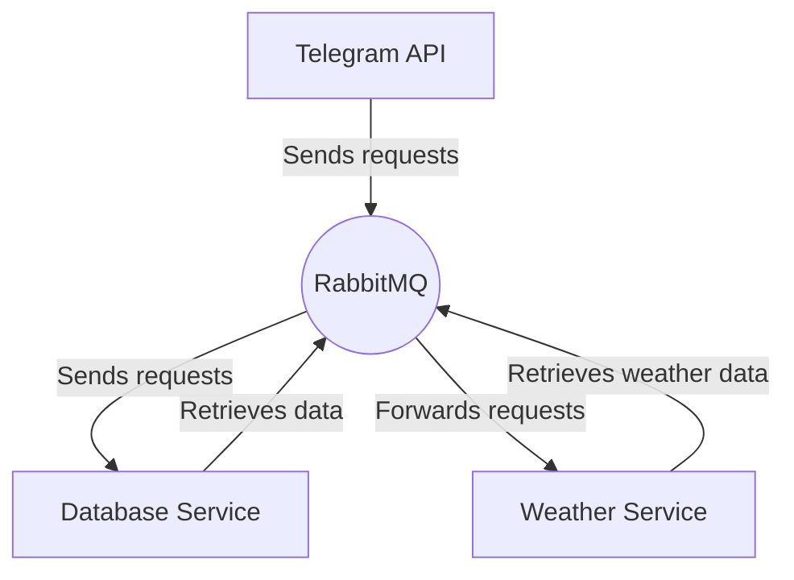

# WeatherBotApi (in progress...)

## Overview

WeatherBotApi is an educational project aimed at learning microservices development on the .NET platform and improving skills in ASP.NET, RabbitMQ, Entity Framework, PostgreSQL, Mapster, Docker, and xUnit.

## Description

WeatherBot is a Telegram bot designed to provide weather data to users. The project is implemented using a microservices architecture, consisting of three services:

1. **TelegramApi:** A service responsible for handling user requests via the Telegram bot.
2. **DatabaseService:** A service responsible for database operations, including storing and retrieving user data and their requests.
3. **WeatherService:** A service responsible for fetching weather information from an external source.

## Architecture

The following diagram illustrates the interaction between different services in the project:



## Technology Stack

- ASP.NET
- RabbitMQ (MassTransit can be used, but it provides a high-level API)
- Entity Framework
- PostgreSQL
- Mapster
- Docker
- xUnit

## Installation and Running

1. **Clone the repository:**
   ```bash
   git clone https://github.com/shishnk/weather-bot-api.git
   ```
2. **Build Docker containers:**
    ```bash
    git cd WeatherBot
    docker-compose build
    ```
3. **Run containers:**
    ```bash
    docker-compose up
    ```

## Configuration

Before running the project, ensure you have configured the necessary environment variables:

1. **Telegram Bot Configuration:**
    - Create a new bot via [BotFather](https://t.me/botfather) on Telegram.
    - Obtain the token for accessing the bot's API.

2. **Set Environment Variables:**
    - Create a `.env` file in the project's root directory.
    - Add the following variables to the `.env` file:
      ```plaintext
      TELEGRAM_BOT_TOKEN=YOUR_TELEGRAM_BOT_TOKEN
      ```
    - Replace `YOUR_TELEGRAM_BOT_TOKEN` with your Telegram bot token.

Once you have configured the environment variables, you are ready to run the project.

## Contribution and Feedback

If you have suggestions for improving the project or found a bug, please open an issue or submit a pull request. We welcome your contributions!


## License

The project is licensed under the MIT license. For more information, see the [LICENSE](https://github.com/shishnk/weather-bot-api/blob/master/LICENSE).